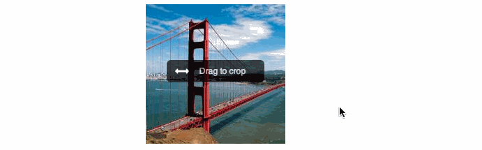

[](https://travis-ci.org/lukaszfiszer/drag-n-crop)

A jQuery plugin for croping images by dragging, inspired by Facebook cover photo.

It aims to be minimalistic and very easy to use for the end-user. It allows to crop the image only in one dimension (no zooming!). A typical usecase would be to crop rectangular images into squares.  If you search for a more advanced croping plugin, there are some [other](https://github.com/tapmodo/Jcrop) [plugins](http://odyniec.net/projects/imgareaselect/) available.


Quick demo!
-------------



Dependencies
-------------

* jQuery
* jQuery UI draggable
* [imagesloaded](/desandro/imagesloaded)


Installation
-----

1.Install the plugin with bower `bower install jquery.drag-n-crop` or download it from this repo.

2.Include drag'n'crop JS and CSS files (+ and its dependencies, if you dont have them already) on your site.
```
<script src='path/to/drag-n-crop/jquery.drag-n-crop.js'></script>
(...)
<link rel="stylesheet" href="path/to/drag-n-crop/jquery.drag-n-crop.css">
```
3.Wrap the photo you want to crop in a element with target width and height

```
<div style="width: 200px; height:200px"></div>
```

4.Initialize the plugin
```
$('#photo').dragncrop();
```


API
---

*jQuery.drag'n'crop* is build using [jQuery widget factory](http://api.jqueryui.com/jQuery.widget/), providing a standard way of interacting with the plugin. It inherits all default [options, events and methods](http://api.jqueryui.com/jQuery.widget/#jQuery-Widget2) but also provides some custom ones, described below:

### Init options

You can customize behaviour of the plugin by passing an option object on initialization, example:

```
$('#photo').dragncrop({
  centered: true,
  overflow: true
});
```

Here's the complete list of available options

| Options                | Description                                       | Default |
| -----------------------|---------------------------------------------------|-------|
| position               | set initial position of the image (see [position](#position-object))  | undefined   |
| centered               | center image in the container on init            |   false   |
| overflow               | show image oveflow when dragging                  |   false   |
| overlay                | show oveflow with a semi-transparent overlay when dragging |   false   |
| instruction            | show text instruction on image                    | false   |
| instructionText        | customize instruction text                        | 'Drag to crop' |
| instructionHideOnHover | hide instruction when hovering over image        | true   |

### Position object

*drag'n'crop* provides a *position* object describing the coordinates of the image inside the container with the following structure

```
{
  offset : [x, y],
  dimension : [x, y]
}
```

* **offset** represents the relative position of the image inside the container and ranges from 0-1. Example `offset: [1,0]` with an image 400x200px and container 200x200: the image is dragged to its right edge.
* **dimension** represents the offset proportional to the image dimensions. Example: `dimension: [0.5, 0]` with an image of 600x200px and container 200x200: image is dragged by 300px (=600x0.5) pixels to the right.

Because *jquery.drag'n'crop* crops only in one dimension, only `x` or `y` changes for a given image - the second is always expected to be 0.

If you set the position (either via `position` option on init, or with `move` method), you must provide the coordinates in one of two formats. Example:

```
$('#horizontal-image').dragncrop({
  position: {offset: [1,0]} // position image on the right
});
```

### Events

Event listener function are passed to the constructor in the same way as options. They are invoke every time an event is triggered. Example:

```
$('#photo').dragncrop({
  start: function() {
    console.log('Dragging started!!')
  }
});
```

Here's the complete list of events emitted by the plugin:

| Event                  | Description                                             | Arguments       |
| -----------------------|---------------------------------------------------------|-----------------|
| start                  | when dragging of the image started                      | event, position |
| drag                   | when dragging occures                                   | event, position |
| stop                   | when dragging finished (user released the mouse button) | event, position |


### Instance methods

Instance methods are invoked by calling the plugin function with the method name provided as a first argument followed by other arguments:

```
$("#photo").dragncrop('move', {offset:{[0,0.2]});
```

Available methods for drag'n'crop plugin:

| Method Name     | Description                                             | Arguments | Returns   |
| ----------------|---------------------------------------------------------|-----------|-----------
| move            | Move image programatically to the given position        | position  | undefined
| getPosition     | retrieves  the current position of the image            | none      | position
| destroy         | Destroy and cleanup the plugin.                         | none      | undefined


Examples
-------------
See [http://lukaszfiszer.github.io/drag-n-crop/examples.html](http://lukaszfiszer.github.io/drag-n-crop/examples.html)


Release History
---------------
0.1.1 - fixing manifest files
0.1.0 - initial release

